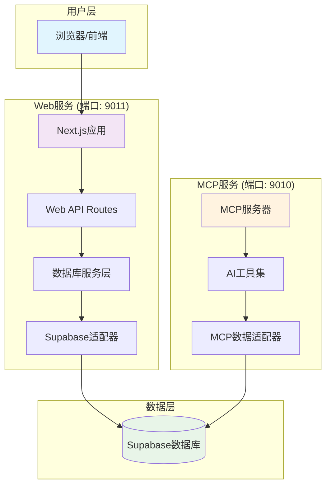

# PromptHub 解耦架构说明

## 概述

本文档描述了PromptHub项目中Web服务和MCP服务的完全解耦架构设计。这种设计确保了两个服务的独立性，同时保持数据的一致性。

## 架构图



## 服务职责划分

### Web服务 (Next.js)
- **端口**: 9011
- **职责**: 
  - 用户界面和交互
  - 用户认证和会话管理
  - 业务逻辑处理
  - 直接数据库访问
  - RESTful API提供
- **不依赖**: MCP服务

### MCP服务
- **端口**: 9010
- **职责**:
  - AI工具和模型交互
  - MCP协议实现
  - AI相关业务逻辑
  - 独立的数据访问
- **不依赖**: Web服务

## 数据库访问

### 共享数据库
- 两个服务使用同一个Supabase数据库
- 通过不同的适配器层访问
- 保持数据一致性

### 访问模式

#### Web服务数据访问
```
前端请求 → Next.js API Routes → DatabaseService → SupabaseAdapter → Supabase
```

#### MCP服务数据访问
```
AI工具调用 → MCP工具处理器 → MCP适配器 → Supabase
```

## 主要组件

### 1. 数据库服务层 (`web/src/lib/database-service.ts`)
```typescript
export class DatabaseService {
  // 提示词管理
  async getPrompts(filters?: PromptFilters): Promise<PaginatedResponse<Prompt>>
  async getPromptByName(name: string): Promise<PromptDetails | null>
  async createPrompt(promptData: Partial<PromptDetails>): Promise<Prompt>
  async updatePrompt(name: string, promptData: Partial<PromptDetails>): Promise<Prompt>
  async deletePrompt(name: string, userId?: string): Promise<boolean>
  
  // 基础数据
  async getCategories(): Promise<string[]>
  async getTags(): Promise<string[]>
  
  // 社交功能
  async addComment(promptId: string, content: string, userId: string): Promise<Comment>
  async getComments(promptId: string): Promise<PaginatedResponse<Comment>>
  async addInteraction(promptId: string, type: string, userId: string): Promise<boolean>
}
```

### 2. Web API路由
- `/api/prompts` - 提示词列表和创建
- `/api/prompts/[name]` - 提示词详情、更新、删除
- `/api/categories` - 分类列表
- `/api/tags` - 标签列表
- `/api/auth/*` - 认证相关
- `/api/users/*` - 用户管理

### 3. 认证系统
```typescript
// 使用Supabase认证
export function withApiAuth(handler: Function) {
  return async (req: NextApiRequest, res: NextApiResponse) => {
    // 验证JWT令牌
    // 提取用户信息
    // 调用业务处理函数
  }
}
```

## 解耦优势

### 1. 服务独立性
- Web服务可以独立部署和扩展
- MCP服务专注于AI功能
- 互不影响的升级和维护

### 2. 技术栈灵活性
- Web服务可以使用任何前端技术
- MCP服务可以使用不同的AI框架
- 数据库可以根据需要切换

### 3. 性能优化
- 直接数据库访问，减少网络延迟
- 减少服务间通信开销
- 更好的缓存策略

### 4. 安全性提升
- 减少服务间攻击面
- 独立的认证和授权
- 更好的错误隔离

## 部署架构

### Docker部署
```yaml
services:
  web:
    ports:
      - "9011:3000"
    environment:
      - NEXT_PUBLIC_SUPABASE_URL
      - SUPABASE_SERVICE_ROLE_KEY
    
  mcp:
    ports:
      - "9010:9010"
    environment:
      - SUPABASE_URL
      - SUPABASE_KEY
    
  nginx:
    ports:
      - "80:80"
    # 反向代理配置
```

### Nginx配置
```nginx
# Web应用
location / {
    proxy_pass http://web:3000;
}

# MCP API (仅供AI工具使用)
location /mcp/ {
    proxy_pass http://mcp:9010/;
    # 可选：限制访问来源
}
```

## 迁移指南

### 从耦合架构迁移到解耦架构

1. **停止使用MCP代理API**
   ```typescript
   // 旧方式 ❌
   await mcpProxy('/mcp/tools/get_prompts/invoke', 'POST', params);
   
   // 新方式 ✅
   await databaseService.getPrompts(filters);
   ```

2. **更新前端API调用**
   ```typescript
   // 旧方式 ❌
   const response = await mcpApi.post('/tools/create_prompt/invoke', data);
   
   // 新方式 ✅
   const response = await api.post('/prompts', data);
   ```

3. **移除MCP客户端依赖**
   ```typescript
   // 删除
   import { mcpApi } from '@/lib/api';
   
   // 使用
   import { databaseService } from '@/lib/database-service';
   ```

## 监控和日志

### Web服务监控
- API响应时间
- 数据库查询性能
- 用户会话状态
- 错误率统计

### MCP服务监控
- AI工具调用频率
- 模型响应时间
- 工具执行成功率
- 资源使用情况

## 维护建议

1. **定期同步数据库模式**
   - 确保两个服务使用相同的数据库结构
   - 统一字段命名和类型定义

2. **版本兼容性**
   - 保持数据库适配器的接口一致性
   - 向后兼容的API设计

3. **测试策略**
   - 独立测试各个服务
   - 集成测试数据库交互
   - 端到端功能测试

## 总结

解耦架构使PromptHub项目具有更好的可维护性、可扩展性和灵活性。Web服务专注于用户体验和业务逻辑，MCP服务专注于AI功能，两者通过共享数据库保持数据一致性，实现了真正的服务解耦。 