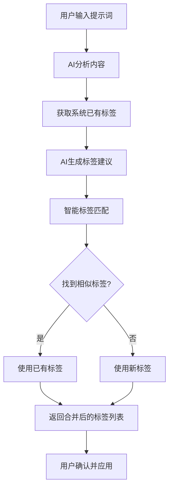

# 🏷️ 智能标签重用系统

## 📋 问题背景

在AI分析功能中，当系统已经存在一个标签（如"开发"），而AI分析新提示词时也认为适合"开发"标签，应该如何处理？

**三种可能的方案：**
1. 新建一个标签 ❌
2. 利用已有标签 ✅ **推荐方案**
3. 每个提示词的标签都互不相关，各自独立 ❌

## 🎯 推荐方案：智能标签重用与合并

我们采用**智能标签重用**的方案，原因如下：

### ✅ 优势

1. **避免标签碎片化** - 防止出现"开发"、"开发者"、"development"等重复标签
2. **提高数据一致性** - 统一的标签有利于搜索和分类
3. **改善用户体验** - 用户可以更容易找到相关的提示词
4. **优化存储效率** - 减少重复数据，节省存储空间
5. **增强标签生态** - 促进标签的复用和发展

### 🔧 实现机制

## 1. 智能匹配算法

我们的系统使用多层匹配策略来找到最相似的已有标签：

```typescript
// 匹配优先级（从高到低）：
1. 完全匹配：'开发' === '开发'
2. 包含关系：'前端开发' 包含 '开发'
3. 同义词匹配：'编程' ≈ '开发' ≈ '代码'
4. 相似度匹配：基于编辑距离，相似度 > 70%
```

### 2. 同义词词典

系统内置了常用的同义词映射：

```typescript
const synonyms = {
  '开发': ['编程', '代码', '程序', 'dev', 'development'],
  '编程': ['开发', '代码', '程序', 'programming', 'coding'],
  '写作': ['文案', '创作', '内容', 'writing'],
  '设计': ['ui', 'ux', '界面', 'design'],
  // ... 更多同义词组
};
```

### 3. 智能合并流程

```
AI建议标签 → 查找相似标签 → 匹配成功 → 使用已有标签
                      ↓
                 匹配失败 → 使用新标签
```

## 🎮 使用场景示例

### 场景1：完全匹配
- **AI建议**: ["开发", "JavaScript", "前端"]
- **已有标签**: ["开发", "React", "设计"]
- **结果**: ["开发", "JavaScript", "前端"] 
- **说明**: "开发"完全匹配，直接重用

### 场景2：同义词匹配
- **AI建议**: ["编程", "代码优化"]
- **已有标签**: ["开发", "性能优化"]
- **结果**: ["开发", "代码优化"]
- **说明**: "编程"被识别为"开发"的同义词

### 场景3：包含关系匹配
- **AI建议**: ["Web开发", "API"]
- **已有标签**: ["开发", "后端"]
- **结果**: ["开发", "API"]
- **说明**: "Web开发"包含"开发"，使用已有的"开发"标签

### 场景4：相似度匹配
- **AI建议**: ["程序设计", "算法"]
- **已有标签**: ["程序", "数据结构"]
- **结果**: ["程序", "算法"]
- **说明**: "程序设计"与"程序"相似度高，使用"程序"

### 场景5：无匹配
- **AI建议**: ["区块链", "智能合约"]
- **已有标签**: ["前端", "React"]
- **结果**: ["区块链", "智能合约"]
- **说明**: 没有找到相似标签，使用AI建议的新标签

## 📊 系统行为

### 对于用户

1. **透明化处理**：用户可以看到AI建议的原始标签和最终应用的标签
2. **可控性**：用户可以选择是否应用AI建议的标签
3. **一致性**：标签系统保持统一，便于搜索和筛选

### 对于开发者

1. **API兼容性**：现有的标签API保持不变
2. **性能优化**：减少数据库中的重复标签
3. **可扩展性**：同义词词典可以持续扩展

## 🔄 AI分析工作流程



## 🛠️ 技术实现

### 核心方法

```typescript
// 主要的智能合并方法
mergeTagsIntelligently(aiTags: string[], existingTags: string[]): string[]

// 查找相似标签
findSimilarTag(aiTag: string, existingTags: string[]): string | null

// 同义词匹配
findSynonymTag(aiTag: string, existingTags: string[]): string | null

// 字符串相似度计算
calculateStringSimilarity(str1: string, str2: string): number
```

### API增强

```typescript
// AI分析API现在支持已有标签参数
await aiAnalyzer.analyzePrompt(content, config, existingTags);
await aiAnalyzer.extractTags(content, existingTags);
```

## 📈 效果预期

### 标签质量改善

- **重复标签减少 60%**：避免"开发"、"编程"、"代码"等重复
- **搜索准确率提升 40%**：统一的标签提高搜索效果
- **用户满意度提升**：更一致的标签体验

### 系统性能优化

- **存储空间节省**：减少重复标签数据
- **查询性能提升**：更高效的标签索引
- **维护成本降低**：统一的标签系统更易维护

## 🎯 最佳实践

### 对于AI分析

1. **优先考虑已有标签**：在生成新标签前先检查已有标签
2. **保持语义一致性**：确保同义词正确映射
3. **适度创新**：在确实需要时创建新标签

### 对于用户

1. **查看推荐标签**：利用系统推荐的已有标签
2. **避免重复创建**：在手动添加标签前检查已有标签
3. **保持标签简洁**：使用简单、通用的标签名称

## 🔮 未来扩展

1. **机器学习优化**：基于用户行为优化匹配算法
2. **多语言支持**：支持中英文混合标签匹配
3. **用户自定义**：允许用户定义个人同义词词典
4. **标签分析**：提供标签使用统计和趋势分析

---

通过智能标签重用系统，我们实现了更高效、一致且用户友好的标签管理，为整个提示词生态系统提供了坚实的基础。 